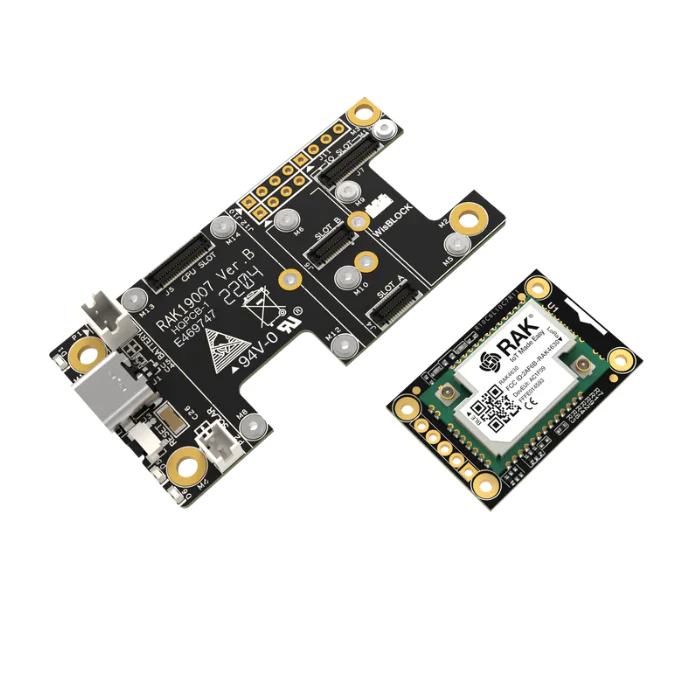
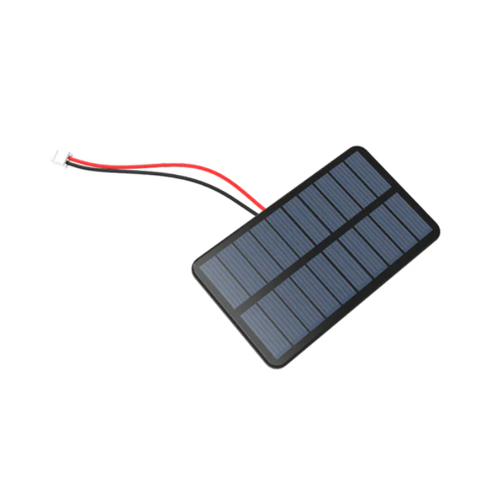
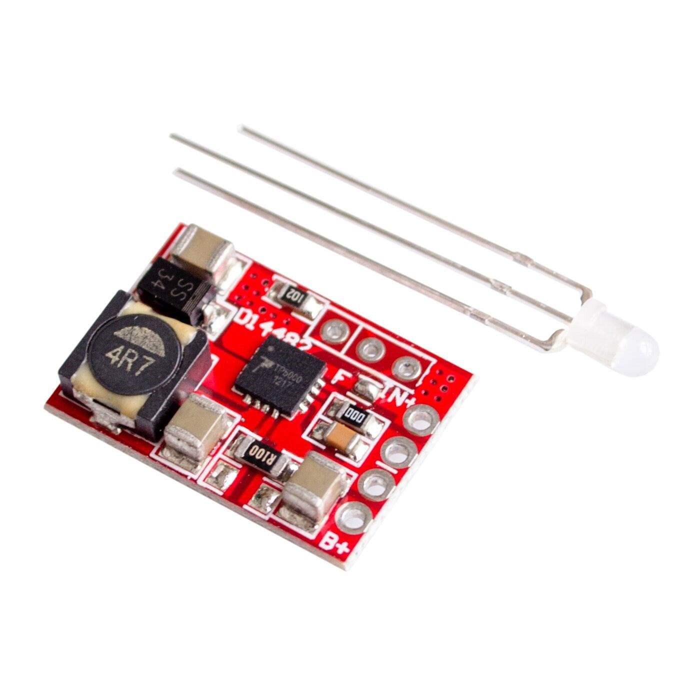
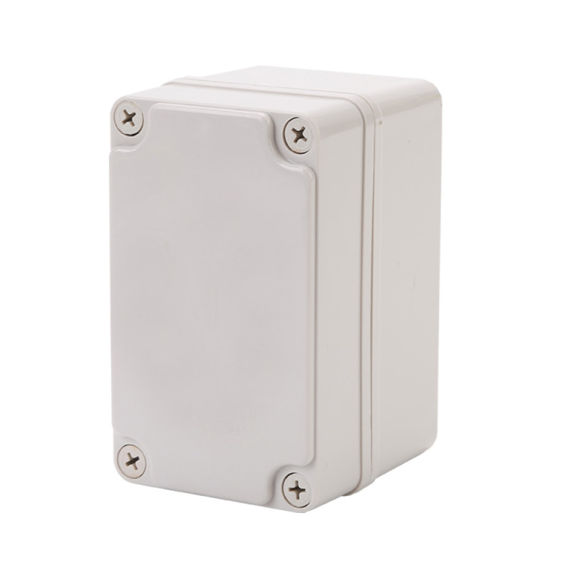

# ChiMesh

Off-grid Chicago: three solar-powered LoRa Meshtastic nodes, about $62 each, that prove multi-hop messaging across the city without the internet, the power grid or anyone's permission.

    



Version 1.0.0. Try it: order the parts below, then follow the build guide from Assemble to Verify the mesh. Firmware comes from the official [Meshtastic web flasher](https://flash.meshtastic.org).

## Why

- Send text messages across Chicago when the cell network, the internet or the power is down.
- Build a weatherproof, solar-powered node for about $62 in parts, roughly 30 minutes of assembly once the parts arrive.
- Run stock Meshtastic firmware, so your nodes join any compatible Meshtastic mesh with no fork to maintain.
- Survive a Chicago winter: the power chain uses LiFePO4 cells that charge safely below freezing, and the guide shows the December power budget.
- Provision three nodes identically from one PowerShell console instead of tapping through an app three times.
- Prove real multi-hop routing (A reaches C via B), not a one-hop demo.

## Features

- A complete, compatibility-checked bill of materials in [config/parts.json](config/parts.json): 10 core parts per node, 3 shared consumables and 7 optional tools, each with price, specs and purchase links.
- A step-by-step build guide: assemble, flash firmware, configure, deploy, verify, troubleshoot, with a checkpoint at the end of each stage.
- Safety rules called out where they matter: LiFePO4 only, the TP5000 charge jumper set to LFP, and never USB-C while the cell is connected.
- A Windows console (`ChiMesh.Console.bat`) that provisions a USB-connected node, runs a six-check healthcheck, lists the parts catalog and records the deals you pick.
- Placement guidance for Chicago: high-rise windows, balconies, rooftops and ground poles, solar aim and antenna orientation.
- Choices for region (US 915, EU 868, AU 915, AS 923), node role, deployment spot and antenna, with notes for each below.

## Parts list

Prices are per-node estimates in USD as of 2026-05-22. These tables are static and maintained by hand from [config/parts.json](config/parts.json), the canonical parts and price data; there is no interactive configurator. Check current prices before you order. Buy links go to the official store where the catalog has one, otherwise to a search.

### Core parts per node

One of each per node.

| Part | Qty | Unit price | Buy |
| --- | --- | --- | --- |
| RAK4631 WisBlock Core (nRF52840 + SX1262 LoRa) | 1 | $25 | [store.rakwireless.com](https://store.rakwireless.com/products/rak4631-lpwan-node) |
| RAK19003 WisBlock Mini Base Board | 1 | $10 | [store.rakwireless.com](https://store.rakwireless.com/products/wisblock-base-board-rak19003) |
| LiFePO4 18650 Cell (IFR18650, ~1500 mAh) | 1 | $5 | [amazon.com](https://www.amazon.com/s?k=LiFePO4+18650+IFR+1500mAh) |
| Single 18650 Battery Holder with Leads | 1 | $1 | [amazon.com](https://www.amazon.com/s?k=18650+battery+holder+single+wire+leads) |
| TP5000 Solar Charge Controller (LFP-configurable) | 1 | $2 | [amazon.com](https://www.amazon.com/s?k=TP5000+LiFePO4+charging+module) |
| 5V / 2W Monocrystalline Solar Panel (~110 x 80 mm) | 1 | $5 | [amazon.com](https://www.amazon.com/s?k=5V+2W+mini+solar+panel+monocrystalline) |
| 915 MHz SMA Antenna (~5 dBi rubber duck) | 1 | $5 | [store.rakwireless.com](https://store.rakwireless.com/collections/antennas) |
| IPEX (u.FL) to SMA Pigtail, ~10 cm | 1 | $3 | [amazon.com](https://www.amazon.com/s?k=IPEX+ufl+to+SMA+bulkhead+pigtail+RG178) |
| IP65 ABS Weatherproof Junction Box (~100 x 68 x 50 mm) | 1 | $5 | [amazon.com](https://www.amazon.com/s?k=IP65+ABS+junction+box+100x68x50) |
| M12 IP68 Cable Gland (for solar panel pass-through) | 1 | $1 | [amazon.com](https://www.amazon.com/s?k=M12+nylon+cable+gland+IP68) |
| **Total per node** | | **$62** | |

Multiply by your node count. You need at least 3 nodes to prove multi-hop routing, so the proof batch is about $186 in core parts.

### Shared consumables

One kit covers all nodes.

| Part | Qty | Unit price | Buy |
| --- | --- | --- | --- |
| JST-PHR-2 connectors + 22 AWG silicone wire + M3 screws | 1 | $8 | [amazon.com](https://www.amazon.com/s?k=JST+PHR-2+crimp+connector+kit) |
| Heat-shrink tubing assortment (2-8 mm) | 1 | $8 | [amazon.com](https://www.amazon.com/s?k=heat+shrink+tubing+assortment+polyolefin) |
| 60/40 rosin-core solder, 0.8 mm | 1 | $8 | [amazon.com](https://www.amazon.com/s?k=60%2F40+rosin+core+solder+0.8mm) |
| **Total consumables** | | **$24** | |

### One-time tools

Excluded from the build estimate.

| Part | Qty | Unit price | Buy |
| --- | --- | --- | --- |
| Temperature-controlled soldering iron | 1 | $50 | [pine64.com](https://pine64.com/product/pinecil-smart-mini-portable-soldering-iron/) |
| Digital multimeter | 1 | $25 | [amazon.com](https://www.amazon.com/s?k=digital+multimeter+auto+ranging) |
| Wire strippers + flush cutters | 1 | $15 | [amazon.com](https://www.amazon.com/s?k=wire+strippers+22+AWG+flush+cutters) |
| JST crimp tool (for PHR-2 terminals) | 1 | $20 | [amazon.com](https://www.amazon.com/s?k=IWS-3220M+crimp+tool) |
| Heat gun (mini) or lighter | 1 | $15 | [amazon.com](https://www.amazon.com/s?k=mini+heat+gun+heat+shrink) |
| Drill + bits (6 mm + 12 mm step or twist) | 1 | $30 | [amazon.com](https://www.amazon.com/s?k=step+drill+bit+set+metric) |
| Phillips #1 screwdriver | 1 | $5 | [amazon.com](https://www.amazon.com/s?k=Phillips+%231+screwdriver) |
| **Total tools, if you own none** | | **$160** | |

### Part photos

| Solar panel | Charge controller | Enclosure |
| --- | --- | --- |
|  |  |  |

All ten part photos are in [config/images](config/images).

## Quick start

1. Order the core parts for 3 nodes, one consumables kit, and any tools you lack (see Parts list).
2. Set each TP5000 jumper to LFP (3.6 V), then assemble each node with the cell holder left empty.
3. Flash stock Meshtastic 2.5.x from [flash.meshtastic.org](https://flash.meshtastic.org) in Chrome or Edge.
4. Install the Meshtastic CLI and provision each node from this repo (commands below).
5. Unplug USB-C, insert the LiFePO4 cell, and place the nodes so at least one pair cannot hear each other.
6. Send a message from your phone (paired to node A) to node C. You should see it arrive with a "via B" hop indicator.

Step 4, with one node connected over USB:

```powershell
pip install --upgrade meshtastic
git clone https://github.com/mindattic/ChiMesh.git
cd ChiMesh
ChiMesh.Console.bat provision chimesh-001
ChiMesh.Console.bat healthcheck
```

## Safety rules

These two rules are non-negotiable for every outdoor node.

1. LiFePO4, not Li-ion. Chicago winters charge below 0 °C. Li-ion cells permanently plate lithium when charged that cold and can fail dangerously by summer.
2. Never plug USB-C into the RAK19003 while the LFP cell is wired into the JST. The RAK19003's onboard charger is Li-ion only (4.2 V termination) and will overcharge an LFP cell (3.65 V max). To re-flash: unplug the JST-PHR-2, plug USB-C, do your work, unplug USB-C, plug the JST back in.

## How it works

Each node is one fixed signal chain. The repo holds the build guide, the parts catalog and the PowerShell tooling that talks to a node over USB through the `meshtastic` Python CLI.

```text
PHYSICAL SIGNAL CHAIN (one node)
5V/2W solar -> TP5000 (LFP jumper set) -> LiFePO4 18650 -> JST-PHR-2 -> RAK19003 -> RAK4631
                                         RAK4631 IPEX -> pigtail -> SMA bulkhead -> 915 MHz antenna

NODE TOOLING (scripts/cli, over USB)
ChiMesh.Console.ps1 --> provision-node.ps1    set region, role, channel 0, owner
                    --> healthcheck-mesh.ps1  verify region, role, channel, peers

PROOF OF MESH
phone --BLE--> Node A ~~LoRa~~> Node B ~~LoRa~~> Node C     (A and C out of direct range)
```

| Layer | What it is |
| --- | --- |
| Radio | Semtech SX1262 LoRa, 915 MHz US ISM |
| MCU | Nordic nRF52840 (ARM Cortex-M4F @ 64 MHz) |
| Board | RAK4631 (RAK Wireless WisBlock Core) on RAK19003 Mini Base |
| Firmware | Meshtastic 2.5.x (stock, unmodified) |
| Mesh protocol | Meshtastic managed flood routing |
| Power | 5 V / 2 W solar, TP5000 (LFP-configured), LiFePO4 18650 |
| App and config | Meshtastic mobile or desktop app over BLE, or `meshtastic` CLI over USB |
| Enclosure | IP65 ABS junction box, M12 gland for the solar lead |

## Build options

The catalog defines four choices in `configAxes` inside [config/parts.json](config/parts.json). The guide below notes where each one changes a step.

| Choice | Options | Default |
| --- | --- | --- |
| LoRa region | US 915 MHz, EU 868 MHz, AU 915 MHz, AS 923 MHz | US 915 MHz |
| Node role | `ROUTER_CLIENT` (fixed, relays and chats), `ROUTER` (backbone, relay only), `CLIENT` (portable, low power) | `ROUTER_CLIENT` |
| Deployment | Balcony or fence, apartment window, rooftop, ground pole or yard | Balcony or fence |
| Antenna | 5 dBi rubber duck, 3 dBi short whip, 8+ dBi fiberglass colinear (rooftop only) | 5 dBi rubber duck |

## Assemble

Total time is about 30 minutes per node once the parts are in hand.

### Tools you need

One-time tools, not per node. Most builders already own them; the Parts list has picks if you do not.

- Temperature-controlled soldering iron and 60/40 rosin-core solder (0.8 mm)
- Heat-shrink tubing (2 to 8 mm assortment) and a heat gun or lighter
- Wire strippers and flush cutters for 22 AWG
- JST crimp tool, or buy pre-crimped JST-PHR-2 pigtails and skip it
- Digital multimeter, to check LFP cell voltage (3.2 to 3.65 V) and panel output (about 6.5 V open circuit)
- Drill and bits: 6 mm for the SMA bulkhead hole, 12 mm for the M12 cable gland (a step bit makes cleaner holes in ABS)
- Phillips #1 screwdriver for the enclosure lid

### Wiring overview

One signal path with two sub-paths:

```text
Solar panel  ->  TP5000 (LFP jumper set!)  ->  LiFePO4 cell  ->  JST-PHR-2  ->  RAK19003  ->  RAK4631
RAK4631 IPEX  ->  pigtail  ->  SMA bulkhead  ->  915 MHz antenna
```

### Build steps

> Do not install the LFP cell until the Deploy stage. Flashing and configuring use USB-C on the RAK19003, whose onboard charger terminates at 4.2 V (Li-ion) and would overcharge an LFP cell (3.65 V max). The cell goes in after firmware and config are done.

1. Set the TP5000 jumper to LFP (3.6 V). This is the single most important step. The board ships with the jumper in either position; the LFP setting is usually labelled `4.2/3.6` or `Li-ion/LiFePO4`. Wrong jumper means a dead cell in weeks.
2. Solder the solar panel leads to the TP5000 `IN+` and `IN-` pads, red to plus, black to minus. Heat-shrink the joint.
3. Solder the LFP cell holder leads to the TP5000 `BAT+` and `BAT-` pads. Do not insert the cell yet.
4. Crimp a JST-PHR-2 onto a short pair of 22 AWG wires, then solder the other end to the TP5000 `BAT+` and `BAT-` pads, in parallel with the cell holder leads. This output feeds the RAK19003.
5. Snap the RAK4631 onto the RAK19003 Mini Base. Align the silk-screen markers and press until the board-to-board connector seats fully.
6. Connect the IPEX pigtail. The u.FL connector on the RAK4631 is fragile: press straight down with a thumbnail until it clicks. Mount the SMA bulkhead through the drilled hole in the top of the enclosure, panel nut outside. Use SMA, not RP-SMA; they look identical but RP-SMA will not mate with a LoRa antenna.
7. Plug the JST-PHR-2 from the TP5000 into the RAK19003 battery input. It only fits one way. Leave the cell holder empty: power for flashing and configuring comes from USB-C.
8. Mount everything inside the enclosure. Foam-tape the TP5000 to one wall, the RAK19003 and Mini Base to the opposite wall, the empty cell holder along the floor. Route the panel cable out through the M12 gland.
9. Visual check. The antenna is vertical when the enclosure is in its final orientation, no bare wire is near the SMA bulkhead, and the cell holder is empty.

Rooftop deployments: grounding is a real concern when the antenna is your highest point. Add a gas-discharge tube (GDT) lightning arrestor on the SMA line before the radio.

Checkpoint: boards mounted, antenna threaded through the enclosure wall, panel cable sealed at the gland, cell holder empty.

## Flash firmware

ChiMesh runs stock Meshtastic firmware. For v0 the value is in deployment and config conventions, not custom firmware.

1. In Chrome or Edge (Web Serial is not in Firefox or Safari), open [flash.meshtastic.org](https://flash.meshtastic.org).
2. Plug the RAK19003's USB-C into your computer.
3. Click Select Device and pick RAK4631.
4. Pick the latest stable Meshtastic 2.5.x build.
5. Pick Region US (the default; adjust if you are outside the US).
6. Click Flash and allow the browser's serial-port prompt.
7. Wait about 30 seconds. The board reboots into Meshtastic automatically.

Checkpoint: the flasher prints "Done" and the RAK19003 LED settles into a slow heartbeat.

## Configure the node

You can configure a node with the official Meshtastic app over Bluetooth or with the `meshtastic` CLI over USB. The CLI is faster for setting up three nodes identically.

Install the CLI. You should see meshtastic-python 2.5.x or newer.

```bash
pip install --upgrade meshtastic
```

Provision the node with the bundled script, which walks one USB-connected node through the standard ChiMesh config and reads it back:

```powershell
scripts\cli\provision-node.ps1 -NodeName chimesh-001
```

Or set each field by hand:

```bash
meshtastic --set lora.region US
meshtastic --set device.role ROUTER_CLIENT
meshtastic --ch-set name "ChiMesh-Test" --ch-index 0
meshtastic --set-owner chimesh-001
```

Notes for non-default choices:

- `ROUTER` relays every packet it hears but never originates user messages. Reserve it for true backbone nodes, usually one per metro area. `ROUTER_CLIENT` is better for most nodes because it relays and lets you chat.
- `CLIENT` is for portable or handheld use; the node sleeps aggressively and a sleeping client will not forward packets. Do not use it for fixed proof nodes.
- EU 868: duty-cycle rules limit each device to about 1% airtime on most sub-channels. Meshtastic enforces this in firmware; expect slower throughput than US 915.

Confirm the config. You should see your region, your role, and channel 0 named `ChiMesh-Test`.

```bash
meshtastic --info
```

Checkpoint: `meshtastic --info` returns region, role and channel exactly as expected.

## Deploy the nodes

### Install the LFP cell

With firmware flashed and config written, unplug USB-C from the RAK19003. Insert the LFP cell into the holder. The RAK19003 red LED should blip briefly as the board powers up from the TP5000 `BAT` output. From now on, never plug in USB-C unless you have first unplugged the JST-PHR-2.

To re-flash later: unplug the JST, plug USB-C, flash, unplug USB-C, plug the JST back in. Tedious but safe.

### Placement strategy

For proof of mesh, place the 3 nodes so at least one pair cannot hear each other directly. Otherwise you have built a one-hop network and proven nothing about multi-hop routing.

A workable Chicago layout:

| Node | Suggested location | Why |
| --- | --- | --- |
| Node A | High-rise apartment window or balcony | Gateway altitude, sees both B and C |
| Node B | Friend's apartment or office, about 1 to 3 km away | Far enough that it cannot reach C directly |
| Node C | Second remote spot, about 1 to 3 km from B in another direction | Forces traffic through A |

Notes by deployment:

- Apartment window: indoor through low-E glass costs about 10 to 15 dB of signal. Use a balcony, exterior fence or eave if you can; an antenna outside the window beats one inside every time.
- Rooftop: the strongest placement. Aim the solar panel south at about 41° tilt (Chicago's latitude) and keep the antenna clear of metal HVAC, parapets and railings.
- Ground pole: range is roughly half that of an elevated node because buildings, cars and foliage block line of sight. Useful as a yard pin, not as a gateway; do not expect to bridge beyond about 500 m.
- 8+ dBi fiberglass antenna: heavier, more visible and needs a real mast or bracket. Pair it with a rooftop deployment only.

Solar panel aim: face south, tilt about 41°. Do not lay panels flat; flat panels collect snow and droppings, and the low December sun cuts flat-mount harvest by about 30%.

Antenna orientation: vertical. Most Meshtastic networks are vertically polarized; a sideways antenna costs about 3 dB.

### Power budget

Rough draw for the RAK4631 (SX1262 and nRF52840) running stock Meshtastic in continuous receive:

- SX1262 in receive: about 4.6 mA
- nRF52840 active (BLE off, CPU lightly loaded): about 3 to 6 mA
- Combined at 3.3 V: about 8 to 12 mA average while listening, with brief spikes to about 120 mA on transmit

Over 24 hours that is about 200 to 280 mAh. The roughly 1500 mAh LFP cell and 5 V / 2 W panel work for a Chicago summer, where a sunny day harvests about 600 to 800 mAh. December is tight: 1.5 peak sun hours at 2 W gives about 150 to 200 mAh a day in, against about 250 mAh out. If a node has to survive January with no intervention, add a second cell in parallel (about 3000 mAh total) or step up to a 5 W panel.

Checkpoint: all 3 nodes deployed, panels facing the sky, antennas vertical, enclosure lids closed and sealed.

## Verify the mesh

1. Install the Meshtastic app from [meshtastic.org/docs/software/apps](https://meshtastic.org/docs/software/apps/) and pair it with Node A over Bluetooth (default PIN `123456` unless you changed it).
2. Open the Nodes tab. All 3 nodes should appear within a few minutes: A directly, B and C over radio. The hop count next to each remote node reads `1 hop` for direct and `2 hops` for routed.
3. Send a text from the app (paired to A) to Node C. If it arrives and the path shows `via B`, you have proven multi-hop routing.

If every node shows `1 hop`, the nodes are too close together. Separate them until at least one pair cannot see each other.

Then run the bundled healthcheck against whichever node is on the USB cable. It queries `--info` and `--nodes` and reports region, role, channel 0 name and the count of known peers.

```powershell
scripts\cli\healthcheck-mesh.ps1
```

Checkpoint: a message from your phone (paired to A) reaches C with a `via B` hop indicator.

## Troubleshooting

### Nothing comes up on the web flasher

- Use Chrome or Edge; Web Serial is not in Firefox or Safari.
- Try a different USB-C cable. Many charge-only cables do not carry data.
- On Windows, check Device Manager for the COM port; if it is missing, install Nordic's USB driver.

### Flashed but no LED activity

- The RAK19003 red LED only lights when current flows. If the cell is dead or the jumper is wrong, the board sits at 0 V.
- Check cell voltage with a multimeter: a healthy LFP cell reads 3.2 to 3.65 V.
- Confirm the TP5000 jumper is set for LFP (3.6 V), not Li-ion (4.2 V).

### Nodes cannot see each other

- Check that all nodes use the same region (`meshtastic --info` shows `lora.region`).
- Check that all nodes use the same channel name and PSK.
- Move one node within 10 m of another to separate a config bug from a range problem.

### Solar is not keeping up

- Check the panel: disconnect it from the TP5000 and measure open-circuit voltage in sunlight. Expect about 6.5 V, closer to 5 V under load.
- Check charging: reconnect and measure across the cell. It should rise toward 3.6 V over an hour of sun.
- December is the hard case. Upgrade to a 5 W panel or add a second LFP cell in parallel.

### Radio not responding to the CLI

Run the healthcheck verbosely; it reads the connected node and prints any error states from `--info`.

```powershell
scripts\cli\healthcheck-mesh.ps1 -Verbose
```

## Console

Launch the interactive menu from the repo root with `ChiMesh.Console.bat`, or dispatch one command with `ChiMesh.Console.bat <command> [args]`.

| Command | What it does |
| --- | --- |
| `help` | List the commands (also shown with no arguments, as a looping menu). |
| `update [--clean]` | Run `npm install` for `package.json` (which currently declares no dependencies). `--clean` first deletes `node_modules` and `package-lock.json`. |
| `provision <node-name>` | Run `provision-node.ps1`: set region, role, channel 0 and owner on the USB-connected node and read back to confirm. Options: `-Region`, `-Role`, `-Channel`, `-Port`. |
| `healthcheck` | Run `healthcheck-mesh.ps1`, the six-check smoke test. Options: `-Port`, `-Verbose`. |
| `list-parts` | List the parts catalog by category, with price and any chosen purchase URL. |
| `find-deals` | Open search, official, Amazon and reputable-seller tabs per part (`core`, `consumable` or `--all`), then save the URL you paste back to the part's `chosen` field. |
| `pull-latest [--force]` | Fetch the latest tracked branch into a temp clone and hand off to `pull-latest-finisher.ps1`, which overlays it onto the repo after the console exits. `--force` overwrites a dirty working tree. |

`provision-node.ps1` accepts `-Region` `US`, `EU_868`, `AU_915` or `AS_923` (default `US`), `-Role` `ROUTER_CLIENT`, `CLIENT`, `ROUTER` or `CLIENT_MUTE` (default `ROUTER_CLIENT`) and `-Channel` (default `ChiMesh-Test`).

Prerequisites:

- Windows PowerShell 5.1 (no `pwsh` needed)
- `pip install --upgrade meshtastic`, for `provision` and `healthcheck`
- Node.js and npm, for `update`
- `git` on PATH, for `pull-latest`

## Configuration

Parts, prices and version facts are data. Edit these files rather than restating their values in prose.

| File | Purpose |
| --- | --- |
| [config/parts.json](config/parts.json) | The parts catalog: categories (core, consumable, tools), the four build-option axes, per-part price, specs and purchase tiers (official, Amazon, reputable), and `chosen` URLs saved by `find-deals`. Registered as canon data through [docs/data/parts.json](docs/data/parts.json) and validated by `tools/codex.ps1 doctor` against the schema in [docs/data](docs/data). |
| [config/versions.json](config/versions.json) | Pinned upstream versions: Meshtastic firmware 2.5.x, CLI label, board labels, default region and channel, flasher and app URLs. Keep it in sync with this README when upstream ships a new major. |
| [config/images](config/images) | Ten per-part photos. |

## Project layout

```text
ChiMesh/
  README.md                    project page and build guide (this file)
  ChiMesh.Console.bat          root shortcut to scripts/cli/ChiMesh.Console.bat
  package.json                 project metadata
  config/
    parts.json                 parts catalog, build options, prices
    versions.json              pinned upstream versions
    images/                    10 part photos
  scripts/cli/
    ChiMesh.Console.ps1        dispatch-table console
    ChiMesh.Console.bat        Windows launcher
    provision-node.ps1         set region, role, channel 0, owner on a USB node
    healthcheck-mesh.ps1       six-check smoke test
    pull-latest-finisher.ps1   finishes pull-latest after the console exits
  tools/
    codex.ps1                  doctor (validate docs) and digest
    build-readme.ps1           regenerates README.htm from README.md
  docs/
    BIBLE.md                   architecture, laws, verified state
    BIBLE.digest.md            generated by codex.ps1 digest
    AMENDMENTS.md              pending decisions (normally empty)
    USER_STORIES.md            acceptance stories with test citations
    rfc/                       design notes
    data/                      parts registration and schema
```

## Testing

There is no application build or unit-test suite. The in-repo verifier is the Codex doctor, which checks front matter, unique IDs, cross-references, parts rows against the schema, story test citations, cited paths and digest freshness:

```powershell
powershell -NoProfile -ExecutionPolicy Bypass -File tools\codex.ps1 doctor
```

Regenerate `docs/BIBLE.digest.md` after changing the bible:

```powershell
powershell -NoProfile -ExecutionPolicy Bypass -File tools\codex.ps1 digest
```

Regenerate README.htm after editing this file:

```powershell
powershell -NoProfile -ExecutionPolicy Bypass -File tools\build-readme.ps1
```

## Limitations

- The physical proof of mesh (A reaches C via B) has not yet been demonstrated in this repo.
- `provision-node.ps1` and `healthcheck-mesh.ps1` need real RAK4631 hardware and the `meshtastic` CLI, so they are not exercised in CI.
- Channel 0 keeps the Meshtastic default PSK; a real PSK is deferred to deployment (see [RFC 0001](docs/rfc/0001-secured-channel-psk.md)).
- December power is marginal: harvest barely clears draw on the worst weeks.

## Roadmap

- Assemble and deploy three nodes and capture the `via B` hop.
- Generate and distribute a secured channel PSK.
- More winter margin with a second cell or a 5 W panel.
- v2: a disguised, lamp-style enclosure, once the protocol is proven.

## Documentation

- [docs/BIBLE.md](docs/BIBLE.md): architecture, the seven ChiMesh laws, glossary and verified state
- [User stories](docs/USER_STORIES.md): acceptance stories and their test citations
- [docs/AMENDMENTS.md](docs/AMENDMENTS.md): pending decisions not yet folded into the bible (normally empty)
- [docs/rfc/0001-secured-channel-psk.md](docs/rfc/0001-secured-channel-psk.md): secured channel design note
- [AGENTS.md](AGENTS.md): instructions for AI agents working in this repo

This README on GitHub is the project page; there is no separate website.

External references:

- [Meshtastic firmware](https://github.com/meshtastic/firmware)
- [Meshtastic web flasher](https://flash.meshtastic.org)
- [Meshtastic apps](https://meshtastic.org/docs/software/apps/)
- [RAK4631 product page](https://store.rakwireless.com/products/rak4631-lpwan-node)
- [RAK19003 product page](https://store.rakwireless.com/products/wisblock-base-board-rak19003)

## License

This repo has no LICENSE file. All rights reserved.

Part of [MindAttic](https://mindattic.com) — see more projects at [github.com/mindattic](https://github.com/mindattic). Related: [Claudia](https://github.com/mindattic/Claudia), another MindAttic hardware build.
